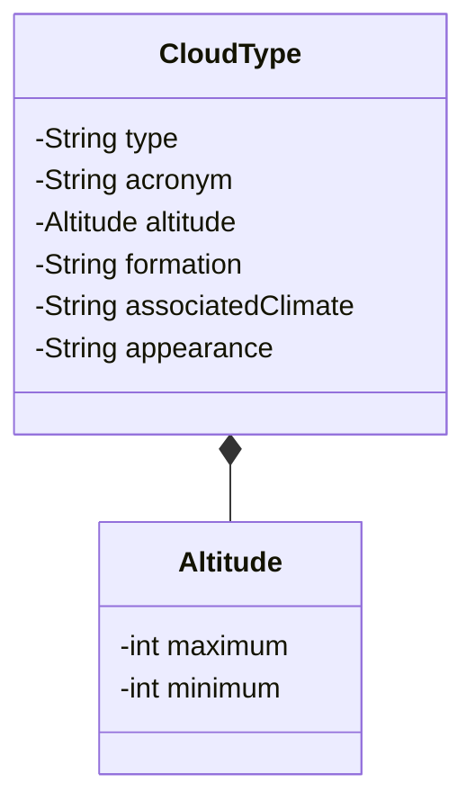

# Desafio-de-projeto-APIrestful
Este projeto foi desenvolvido para o bootcamp 2024 de java backend ministrado pela Dio com o apoio do Santader,
e tem como objetivo a entrega do desafio de projeto de API REST.

## Diagrama de Classes ##



## Accesso ao BD ##
* **USER:** apirest
* **PASSWORD:** apirest

## Tipos de Nuvens: Dados Básicos


**1. Cirrus (Ci):**

* **Altitude:** Alta (6.000 - 13.000 m)
* **Formação:** Cristais de gelo
* **Clima associado:** Tempo claro, mas pode indicar mudança para tempo instável.
* **Aparência:** Fios finos, brancos e delicados, com aparência de penas ou cabelos.

**2. Cumulus (Cu):**

* **Altitude:** Baixa (2.000 - 6.000 m)
* **Formação:** Ar úmido ascendente
* **Clima associado:** Tempo bom, mas podem indicar tempestades em desenvolvimento.
* **Aparência:** Nuvens brancas e fofas com base plana e topo arredondado.

**3. Stratus (St):**

* **Altitude:** Baixa (0 - 2.000 m)
* **Formação:** Ar úmido ascendente lento e gradual
* **Clima associado:** Garoa, nevoeiro e céu nublado.
* **Aparência:** Camada cinzenta e uniforme que cobre todo o céu.

**4. Cumulonimbus (Cb):**

* **Altitude:** Do nível do solo a 18.000 m ou mais.
* **Formação:** Ar instável e úmido ascendente rapidamente.
* **Clima associado:** Tempestades severas com granizo, raios e fortes chuvas.
* **Aparência:** Nuvens altas e escuras com topo em forma de bigorna e base escura e ameaçadora.

**5. Altostratus (As):**

* **Altitude:** Média (2.000 - 6.000 m)
* **Formação:** Ar úmido ascendente e resfriamento.
* **Clima associado:** Chuva ou neve leves.
* **Aparência:** Camada cinzenta e uniforme que cobre todo o céu, mas com aparência mais fina que o Stratus.

**6. Altocumulus (Ac):**

* **Altitude:** Média (2.000 - 6.000 m)
* **Formação:** Ar úmido ascendente e resfriamento.
* **Clima associado:** Tempo instável ou mudança para tempo instável.
* **Aparência:** Nuvens brancas e arredondadas, em grupos ou camadas, com aparência de "pequenas bolas de algodão".

**7. Cirrostratus (Cs):**

* **Altitude:** Alta (6.000 - 13.000 m)
* **Formação:** Cristais de gelo
* **Clima associado:** Aproximação de uma frente quente.
* **Aparência:** Camada fina e transparente que cobre todo o céu, podendo criar halos ao redor do sol ou da lua.

**8. Cirrocumulus (Cc):**

* **Altitude:** Alta (6.000 - 13.000 m)
* **Formação:** Cristais de gelo
* **Clima associado:** Tempo bom ou aproximação de uma frente quente.
* **Aparência:** Nuvens brancas e finas com aparência de ondas ou "pequenas bolas de algodão".

**9. Nimbostratus (Ns):**

* **Altitude:** Baixa (0 - 2.000 m)
* **Formação:** Ar úmido ascendente lento e gradual.
* **Clima associado:** Chuva contínua e persistente.
* **Aparência:** Camada cinzenta e uniforme que cobre todo o céu, com aparência escura e ameaçadora.

**10. Stratocumulus (Sc):**

* **Altitude:** Baixa (0 - 2.000 m)
* **Formação:** Ar úmido ascendente e resfriamento.
* **Clima associado:** Tempo instável ou mudança para tempo instável.
* **Aparência:** Nuvens cinzas ou brancas, em grupos ou camadas, com aparência de "pequenas bolas de algodão".

---

**Exemplo 1 de json:**
```json
{
  "type": "Cirrus",
  "acronym": "Ci",
  "Altitude": {
    "Maximun": 13000,
    "minimum": 6000
  },
  "Formation": "Cristais de gelo",
  "Associated climate": "Tempo claro, mas pode indicar mudança para tempo instável",
  "Appearence": "Fios finos, brancos e delicados, com aparência de penas ou cabelos"
```

**Exemplo 2 de json:**

```json
{
  "type": "Cumulus",
  "acronym": "Cu",
  "Altitude": {
    "Maximun": 6000,
    "minimum": 2000
  },
  "Formation": "Ar úmido ascendente",
  "Associated climate": "Tempo bom, mas podem indicar tempestades em desenvolvimento",
  "Appearence": "Nuvens brancas e fofas com base plana e topo arredondado"
}
```

