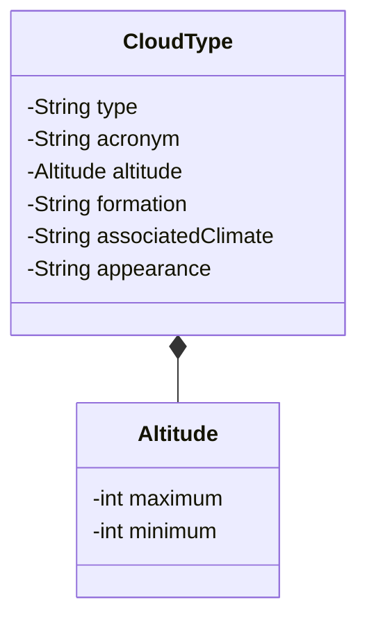

# Desafio-de-projeto-APIrestful
Este projeto foi desenvolvido para o bootcamp 2024 de java backend ministrado pela Dio com o apoio do Santader,
e tem como objetivo a entrega do desafio de projeto de API REST.

##Diagrama de Classes##

